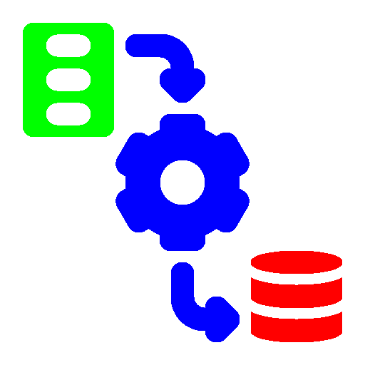

 

<h1 align="center">Hi 👋, My name's Ahmed Abdo.</h1>
	

  

<h3 align="center"> Data Engineer| Machine learning Engineer | Data Science Engineer</h3>

<!------------------------------------education-------------------------------------------->

 
 👉 Click here to see My education

	
<h3 align="center"> 

<strong>University of Ottawa, Canada</strong> 
	Master of Electrical Engineering | Major: Data Science and AI.  
	Graduation Project: “End-to-End Speech Translation of Contemporary Egyptian Arabic Dialect”. 
	Sponsor: 
</h3>
<h3 align="center">

<strong>Faculty of Computers and Information, Zagazig</strong> 
	Bachelor of Computers and informatics | Major: Computer Science | Grade: very good with honor.  
	Graduation Project: “Online Table Reservation and Delivery Service Provider”. 
      Scholarship: Java Standard Edition with MySQL (Global Academy) | .Net Web Development (ITI).
</h3>
	

<h3 align="left">Connect with me:</h3>

 

<h3 align="left">Languages and Tools:</h3>

                      

# Projects

<!------------------------------------Projects-------------------------------------------->

 
 👉 Click here to see My projects

	
<h3> Graduation Projects </h3>

- uOttawa:
[End-to-End Speech Translation of Contemporary Egyptian Arabic Dialect](https://github.com/Ahmed-Abdo-Amin/End-to-EndSpeechTranslationofContemporaryEgyptianArabicDialect1)

<h3> Cloud Analytics</h3>

[Using MongoDB and Cassandra in analysis for both the movies' database and the Sales Manager database](https://github.com/Ahmed-Abdo-Amin/UsingMongoDBandCassandrainanalysisforboththemoviesdatabaseandtheSalesManagerdatabase)

<h3> Data Engineer Nano-Degree using AWS Cloud from Udacity :</h3>
- [Data Modeling with Postgres](https://github.com/Ahmed-Abdo-Amin/UDACITY-DataEngineeringNanodegree/blob/main/1.Module01-DataModeling/Project_Data_Modeling_with_Postgres) | Analyzing the songs of Sparkify by applying data modelling with Postgres and building an ETL pipeline using Python.
- [Project_Data_Modeling_with_Apache_Cassandra](https://github.com/Ahmed-Abdo-Amin/UDACITY-DataEngineeringNanodegree/blob/main/1.Module01-DataModeling/Project_Data_Modeling_with_Apache_Cassandra) | Analyzing the songs of Sparkify by applying data modelling with Apache Cassandra and building an ETL pipeline that transfers data from a set of CSV files within a directory to create a streamlined CSV file to model and insert data into Apache Cassandra tables.
 ----loading ............

<h3> Informatica Tutorial: Beginner to Expert Level from Udemy [From This Link](https://www.udemy.com/course/informatica-tutorial-beginner-to-expert-level/) :
----loading ............

<h3> Data Engineer Specialization By IBM From Coursera :</h3>
	
----loading ............
  
<h3> Spark from Udacity [Click here to go this Course](https://learn.udacity.com/courses/ud2002)</h3>
	
- [MapReduce versus Hadoop MapReduce](https://github.com/Ahmed-Abdo-Amin/MapReduceversusHadoopMapReduce)
- [Data Wrangling with DataFrames & Spark SQL](https://github.com/Ahmed-Abdo-Amin/DataWranglingwithDataFramesandSparkSQL)

<h3> Data Engineering and Machine Learning using Spark From IBM:</h3>
	
-  [ETL and Machine Learning - Project](https://github.com/Ahmed-Abdo-Amin/ETL-and-Machine-Learning-Project.git) | In this Project, We imported data from an external dataset and create a DataFrame. We saved the data to a Parquet file and follow the steps to train the module using with Apache Spark.

<h3> Databases and Data Warehousing in Data Science :</h3>
	
- [A prediction of customer churn rate in the telecom industry and determination of the associations between items purchased.](https://github.com/Ahmed-Abdo-Amin/A_prediction_of_customer_churn_rate_and_-the_associations_between_items_purchased)
- [Build RDBMS using SQL Server and Data Warehousing using SQL Server and R Language in Market-Basket-Analysis (MBA)](https://github.com/Ahmed-Abdo-Amin/RDBMS-SQLData-Warehousing-OLAP)

<h3> Machine Learning (ML):</h3>
	
- [Network Intrusion Detection using Deep Learning](https://github.com/Ahmed-Abdo-Amin/Machine_learning_Project_Detect_anomalies_using_Deep_learning-main)
- [Machine Learning Bagging and Boosting Models](https://github.com/Ahmed-Abdo-Amin/Machine-learning-Bagging-and-Boosting-models-Fourth_assignment-main)
- [Machine Learning Clustering Models](https://github.com/Ahmed-Abdo-Amin/Machine-learning-Clustering-models-Third_assignment-main)
- [Machine Learning Classification Models](https://github.com/Ahmed-Abdo-Amin/-Machine-learning-Classification-models-Second_assignment-main)
- [Build One-vs-Rest and One-vs-One strategies Based-On the Most Important Features](https://github.com/Ahmed-Abdo-Amin/Machine-learning-OVR-vs-OVO-First_assignment-main)

<h3> Natural Language Processing (NLP):</h3>
	
- [Gutenberg Book Classification (Classification-Is-All-You-Need)](https://github.com/Ahmed-Abdo-Amin/Text_Classification_The_Gutenbergs-_books)
- [Gutenberg Book Clustering (Clustering-Is-All-You-Need)](https://github.com/Ahmed-Abdo-Amin/Text_Clustering_The_Gutenbergs-_books)
- [ChatBot For Movie Recommendation system](https://github.com/Ahmed-Abdo-Amin/Movie_Recommendation_system)
- [Manipulating the data ("Gutenberg's couple of digital books") and serializing them.](https://github.com/Ahmed-Abdo-Amin/TextDataPartitioning)

<h3> Smart Cities :</h3>
	
- [Machine learning approach to identify fake tasks](https://github.com/Ahmed-Abdo-Amin/machine-learning-ML-approaches-to-identify-fake-tasks-main)
- [Time Series Anomaly Detection](https://github.com/Ahmed-Abdo-Amin/Time_Series_Anomaly_Detection-main)

<h3> GANs:</h3>
	
- [A Fake Task Filtering Security Layer using CGAN (Conditional GAN)](https://github.com/Ahmed-Abdo-Amin/A-Fake-Task-Filtering-Security-Layer-using-CGAN-Conditional-GAN)

<h3> Computer Vision (CV):</h3>
	
- [Sports Products Multi-Class Classification](https://github.com/Ahmed-Abdo-Amin/SportsProductsMulti-ClassClassification)
- [Glaucoma Detection Using Fudous Images And Convolution Neural Network](https://github.com/Ahmed-Abdo-Amin/Glaucoma_Detection_Using_Fudous_Images_And_Convolution_Neural_Network)
- [Applying Machine Learning Models To Image Classification (the Cifar10 dataset)](https://github.com/Ahmed-Abdo-Amin/ApplyingMachineLearningModelsToImageClassification)
- [Applying Deep Learning Models to Image Classification (Caltech-UCSD Birds-200-2011)](https://github.com/Ahmed-Abdo-Amin/ApplyingDeepLearningModelsToImageClassification)
- [Applying Regularization and Data Augmentation on CNN Model to Image Classification (Leaf counting dataset)](https://github.com/Ahmed-Abdo-Amin/ApplyingRegularization-DataAugmentationOnCNNModelToImageClassification)

<h3> AI For Cyber Security (CS):</h3>
	
- [Detecting malicious Website Using its URL](https://github.com/Ahmed-Abdo-Amin/DetectingmaliciousWebsiteUsingitsURL1)
- [Predicting data exfiltration via DNS](https://github.com/Ahmed-Abdo-Amin/PredictingdataexfiltrationviaDNS)

<h3> Reinforcement Learning (RL):</h3>
	
- [Atari Games using Q-Learning](https://github.com/Ahmed-Abdo-Amin/Atari_Games_using_Q-Learning_ReinforcementLearning)

<h3> Speech Recognition </h3>
	
- [Speech Recognition for Arabic Words](https://www.kaggle.com/code/ahmedabdoamin/speech-recognition-for-arabic-words) | Predict Arabic words by wav files.

# Additional Activities
### Problem Solving ([click here to go my codefocres profile ](https://codeforces.com/profile/ahmedabdoamin997))

 
 👉 Click here for the problems

1. A. Vanya and Fence [Click here to see the details](http://codeforces.com/contest/677/problem/A) --> [Click here to see the solution](https://codeforces.com/contest/677/submission/193214034)
2. A. Anton and Danik [Click here to see the details](https://codeforces.com/contest/734/problem/A) --> [Click here to see the solution](https://codeforces.com/contest/734/submission/193317595)
3. 791A - Bear and Big Brother [Click here to see the details](https://codeforces.com/problemset/problem/791/A) --> [Click here to see the solution](https://codeforces.com/problemset/submission/791/193446956)
4. A - Team  [Click here to see the details](https://codeforces.com/contest/231/problem/A) --> [Click here to see the solution](https://codeforces.com/contest/231/submission/193454502)
5. A. Beautiful Matrix  [Click here to see the details](https://codeforces.com/contest/263/problem/A) --> [Click here to see the solution](https://codeforces.com/contest/263/submission/193587333)
6. A. Gravity Flip  [Click here to see the details](https://codeforces.com/contest/405/problem/A) --> [Click here to see the solution](https://codeforces.com/contest/405/submission/193724385)
7. A - Petya and Strings [Click here to see the details](https://codeforces.com/contest/112/problem/A) --> [Click here to see the solution](https://codeforces.com/contest/112/submission/193820889)
8. A - Boy or Girl [Click here to see the details](https://codeforces.com/contest/236/problem/A) --> [Click here to see the solution](https://codeforces.com/contest/236/submission/193980589)
9. A - Word [Click here to see the details](https://codeforces.com/contest/59/problem/A) --> [Click here to see the solution](https://codeforces.com/contest/59/submission/194095420)
10. A - Word Capitalization [Click here to see the details](https://codeforces.com/contest/281/problem/A) --> [Click here to see the solution](https://codeforces.com/contest/281/submission/194100980)
11. A - Magnets [Click here to see the details](https://codeforces.com/contest/344/problem/A) --> [Click here to see the solution](https://codeforces.com/contest/344/submission/194186313)
12. A - Sereja and Dima [Click here to see the details](https://codeforces.com/contest/381/problem/A) --> [Click here to see the solution](https://codeforces.com/contest/381/submission/194314228)
13. A - Stones on the Table [Click here to see the details](https://codeforces.com/contest/266/problem/A) --> [Click here to see the solution](https://codeforces.com/contest/266/submission/194434072)
14. A - Police Recruits [Click here to see the details](https://codeforces.com/contest/427/problem/A) --> [Click here to see the solution](https://codeforces.com/contest/427/submission/194552039)
15. A - Black Square [Click here to see the details](https://codeforces.com/contest/431/problem/A) --> [Click here to see the solution](https://codeforces.com/contest/431/submission/194652077)
16. A - Night at the Museum [Click here to see the details](https://codeforces.com/contest/731/problem/A) --> [Click here to see the solution](https://codeforces.com/contest/731/submission/194763048)
17. A - Games [Click here to see the details](https://codeforces.com/contest/268/problem/A) --> [Click here to see the solution](https://codeforces.com/contest/268/submission/194894792)
18. A - Buy a Shovel [Click here to see the details](https://codeforces.com/contest/732/problem/A) --> [Click here to see the solution](https://codeforces.com/contest/732/submission/195018953)
19. A - Is your horseshoe on the other hoof? [Click here to see the details](https://codeforces.com/contest/228/problem/A) --> [Click here to see the solution](https://codeforces.com/contest/228/submission/195107140)
20. A - Colorful Stones (Simplified Edition)  [Click here to see the details](https://codeforces.com/contest/265/problem/A) --> [Click here to see the solution](https://codeforces.com/contest/265/submission/195114775)
21. A - Die Roll [Click here to see the details](https://codeforces.com/contest/9/problem/A) --> [Click here to see the solution](https://codeforces.com/contest/9/submission/195238967)
22. A - Shaass and Oskols [Click here to see the details](https://codeforces.com/contest/294/problem/A) --> [Click here to see the solution](https://codeforces.com/contest/294/submission/195422244)
23. A - Juicer [Click here to see the details](https://codeforces.com/contest/709/problem/A) --> [Click here to see the solution](https://codeforces.com/contest/709/submission/195543338)
24. A - Carrot Cakes [Click here to see the details](https://codeforces.com/contest/799/problem/A) --> [Click here to see the solution](https://codeforces.com/contest/799/submission/195803076)
25. A - Anton and Letters [Click here to see the details](https://codeforces.com/contest/443/problem/A) --> [Click here to see the solution](https://codeforces.com/contest/443/submission/195938176)
26. A - Way Too Long Words [Click here to see the details](https://codeforces.com/contest/71/problem/A) --> [Click here to see the solution](https://codeforces.com/contest/71/submission/196089451)
27. A - Free Ice Cream [Click here to see the details](https://codeforces.com/contest/686/problem/A) --> [Click here to see the solution](https://codeforces.com/contest/686/submission/196231247)
28. A - Helpful Maths [Click here to see the details](https://codeforces.com/contest/339/problem/A) --> [Click here to see the solution](https://codeforces.com/contest/339/submission/196361086)
29. A - Team Olympiad [Click here to see the details](https://codeforces.com/contest/490/problem/A) --> [Click here to see the solution](https://codeforces.com/contest/490/submission/196481277)
30. A - New Password [Click here to see the details](https://codeforces.com/contest/770/problem/A) --> [Click here to see the solution](https://codeforces.com/contest/770/submission/196589617)
31. A - Presents [Click here to see the details](https://codeforces.com/contest/136/problem/A) --> [Click here to see the solution](https://codeforces.com/contest/136/submission/196753455)
32. A - Lineland Mail [Click here to see the details](https://codeforces.com/contest/567/problem/A) --> [Click here to see the solution](https://codeforces.com/contest/567/submission/196907241)
33. A - Mahmoud and Longest Uncommon Subsequence [Click here to see the details](https://codeforces.com/contest/766/problem/A) --> [Click here to see the solution](https://codeforces.com/contest/766/submission/197041670)
34. A - Snacktower [Click here to see the details](https://codeforces.com/problemset/problem/767/A) --> [Click here to see the solution](https://codeforces.com/problemset/submission/767/197340711)
35. A - Oath of the Night's Watch [Click here to see the details](https://codeforces.com/contest/768/problem/A) --> [Click here to see the solution](https://codeforces.com/contest/768/submission/197480175)
36. A - Next Round [Click here to see the details](https://codeforces.com/contest/158/problem/A) --> [Click here to see the solution](https://codeforces.com/contest/158/submission/197620962)
37. A - Bit++ [Click here to see the details](https://codeforces.com/contest/282/problem/A) --> [Click here to see the solution](https://codeforces.com/contest/282/submission/197738680)
38. A - Young Physicist (equilibrium) [Click here to see the details](https://codeforces.com/contest/69/problem/A) --> [Click here to see the solution](https://codeforces.com/contest/69/submission/197886152)
39. A - Pangram [Click here to see the details](https://codeforces.com/contest/520/problem/A) --> [Click here to see the solution](https://codeforces.com/contest/520/submission/198070730)
40. A - Twins [Click here to see the details](https://codeforces.com/contest/160/problem/A) --> [Click here to see the solution](https://codeforces.com/contest/160/submission/198343163)
41. A - Keyboard [Click here to see the details](https://codeforces.com/contest/474/problem/A) --> [Click here to see the solution](https://codeforces.com/contest/474/submission/198471040)
42. 

### [ SQLBolt](https://sqlbolt.com/)  
Learn SQL with simple, interactive exercises [Click here to see the solutions](https://github.com/Ahmed-Abdo-Amin/SQLBlot_Exercises)

### Technical Certificates:
02/2022 Predictive Analytics Modeler 2021 Mastery Award, IBM [Click here to see the details](https://www.credly.com/earner/earned/badge/8a4aa04b-4299-4617-b7ea-146116801199) 
03/2022 Big Data Engineer 2021 Mastery Award, IBM [Click here to see the details](https://www.credly.com/earner/earned/badge/12edf4dd-3cfe-4ea1-ba75-dc8b256450c3) 
04/2022 Artificial Intelligence Analyst 2021 Mastery Exam, IBM [Click here to see the details](https://www.credly.com/earner/earned/badge/d1e36ac9-18b6-41fd-a7b3-fbfc947a5d2a) 
04/2022 Dale Carnegie 
04/2022 English, Berlitz 
11/2022 SQL Basic, HackerRank [Click here to see the details](https://www.hackerrank.com/certificates/fc0d41ee4294) 
02/2023 Scripting with Python and SQL for Data Engineering, Coursera [Click here to see the details](https://coursera.org/share/f9374652e7ee41149cc0d416d2f7fc5a) 
02/2023 Stanford Machine Learning | Online, Coursera [Click here to see the details](https://coursera.org/share/0cc4fb600f17c11d389a26ceb6a27763) 
02/2023 Problem Solving (Basic) Certificate, HackerRank [Click here to see the details](https://www.hackerrank.com/certificates/ae2ab0c4004b) 
03/2023 Introduction to Git and GitHub, Google [Click here to see the details](https://coursera.org/share/15c52c390870a3ba05b689024fb4d0b9) 
03/2023 SQL Internediate, HackerRank [Click here to see the details](https://www.hackerrank.com/certificates/42924937e9fb) 
03/2023 SQL Advanced, HackerRank [Click here to see the details](https://www.hackerrank.com/certificates/14131ba06d2f) 
03/2023	Structured Machine Learning Projects | Online, DeepLearning.AI [Click here to see the details](https://coursera.org/share/f588bb9bbb193d819d237ec87f78f5b6) 
03/2023	Introduction to Data Engineering | Online, IBM [Click here to see the details](https://coursera.org/share/04990ecb73c3b2c6681fe9a55700ce46) 
03/2023	Crash Course on Python | Online, Google [Click here to see the details](https://coursera.org/share/9af62323e57575e971a81fe0630b2188) 
03/2023	Data Engineering and Machine Learning using Spark | Online, IBM [Click here to see the details](https://coursera.org/share/5fc72ed485ca630222cc7496b45df6e6) 
03/2023	Data Science & Business Analytics | Remote, The Sparks Foundation [Click here to see the details](https://truecertificates.com/verified/Y3R8MFGK6L) 

### Kaggle-Competitions
- [Spaceship_Titanic](https://github.com/Ahmed-Abdo-Amin/Kaggle-Competitions/tree/main/Spaceship_Titanic)
- [ELG7186 - Assignment 2](https://www.kaggle.com/competitions/assignment-2-binary-classifier/leaderboard)

## Tasks:
### Data Science & Business Analytics Tasks [click here](https://github.com/Ahmed-Abdo-Amin/-Internship_Spark_Foundation/blob/main/DataScience%26BusinessAnalyticsTasks)
- [Prediction using Supervised ML](https://github.com/Ahmed-Abdo-Amin/-Internship_Spark_Foundation/blob/main/DataScience%26BusinessAnalyticsTasks/Task1-Prediction-using-SupervisedML) | Predict the percentage of an student based on the no. of study hours.
- [Prediction using Unsupervised ML](https://www.linkedin.com/posts/ahmed-abdo-amin-abdo-b17193213_task2-gripmarch23-thesparksfoundation-activity-7040025445966176256-l8VT?utm_source=share&utm_medium=member_desktop) | From the given ‘Iris’ dataset, predict the optimum number of clusters and represent it visually.
- [Exploratory Data Analysis - Retail](https://www.linkedin.com/posts/ahmed-abdo-amin-abdo-b17193213_task3-gripmarch23-thesparksfoundation-activity-7043035928621125632-BWlE?utm_source=share&utm_medium=member_desktop) | Find out the weak areas where you can work to make more profit.
--
## 📈 GitHub Stats 
- 

-  

